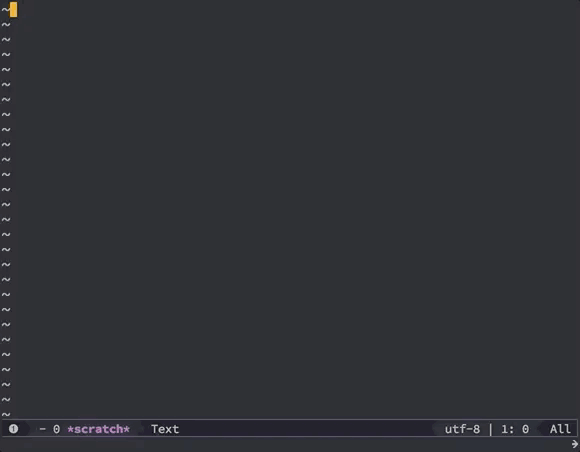

# Stopwatch

A stopwatch in your emacs.



Once installed, open the stopwatch buffer with `M-x stopwatch`. Follow the instructions at the top of the buffer to start, stop and reset the stopwatch and time laps.


## Developing

Tests are written in ERT. Run them with

``` shell
$ make test
```

To check that the code can be packaged and installed correctly, run

``` shell
$ make package-for-local-installation
```

which will generate a `stopwatch-X.X.X.tar` file defining the package. Then in emacs, run `M-x package-install-file` and point it at the tar file. If the package loaded correctly you will now be able to run a stopwatch.
